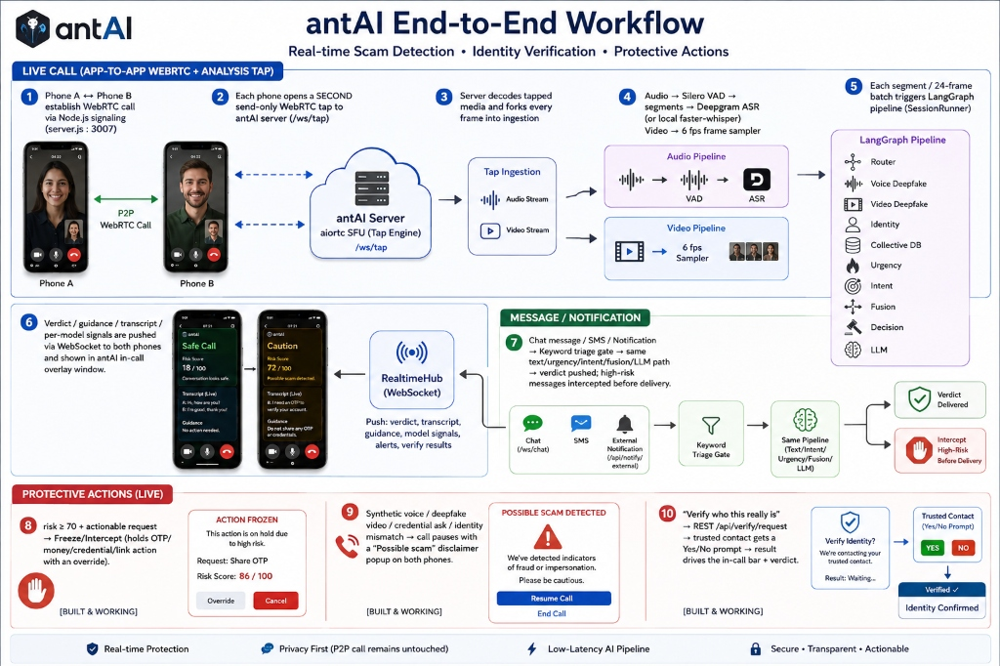

<div align="center">

# 🛡️ antAI
### Real-Time Scam, Deepfake & Impersonation Defense System

<!-- Animated Typing Banner -->
<a href="#">
  
</a>

<p align="center">
  
  
  
  
</p>

<p align="center">
  <a href="#-why-antai"></a>
  <a href="#-end-to-end-workflow"></a>
  <a href="#-langgraph-orchestration-architecture"></a>
  <a href="#-multi-signal-ai-brain"></a>
  <a href="#-quickstart-guide"></a>
  <a href="#-privacy--security"></a>
</p>

<p align="center">
  
  
  
  
  
  
  
</p>

---

### 🚨 *Modern scams no longer look like spam — they look like credible conversations.*
**antAI** is an autonomous, real-time defense layer designed to protect vulnerable and elderly users against AI-generated voice clones, video deepfakes, impersonation of loved ones, and high-pressure financial social engineering.

</div>

---

## 💡 Why antAI?

Modern attacks combine **AI voice cloning**, **face synthesis**, and **emotional urgency**. Standard spam detection methods fail because the scam *looks and sounds like a legitimate conversation*.

### ⚖️ Traditional Spam Filters vs. antAI Active Defense

| Threat Vector | Traditional Call / SMS Blockers | 🛡️ antAI Real-Time Defense |
|:---|:---|:---|
| **AI Voice Clone (e.g. "Kidnapped Grandchild")** | ❌ **Bypassed** (Number spoofed / unlisted) | ✅ **Caught** in $<1.5\text{s}$ via SSL acoustic ensemble & ECAPA voiceprints |
| **Video Deepfake & Face Synthesis** | ❌ **Unsupported** (Cannot analyze video) | ✅ **Detected** using CVPR 2025 DeepfakeDet-ViT + DiCoME evidential CLIP |
| **High-Pressure Urgency Tactics** | ❌ **Ignored** (No semantic understanding) | ✅ **Flagged** via real-time emotional urgency & coercion scoring |
| **OTP / Money Transfer Thefts** | ❌ **Passive Warning Only** (Too late) | ✅ **Autonomous Freeze / Intercept** with conscious override modal |
| **Explainability for Elderly Users** | ❌ **Raw Spam Scores** (Confusing) | ✅ **Plain-Language Verdict**: `Verdict ➔ Why ➔ What To Do Now` |

---

## ⚡ End-to-End Workflow

antAI integrates **live WebRTC call tapping**, **streaming ASR**, **video frame sampling**, and an **agentic LangGraph pipeline** into a unified real-time defense loop.

<div align="center">
  
</div>

<br/>

### 🔄 How the End-to-End Chain Operates:

1. **P2P Calling & Clean-Audio WebRTC Tap**: Phone A $\leftrightarrow$ Phone B establish direct WebRTC communication. In parallel, each device opens a secondary send-only WebRTC tap (`/ws/tap`) to the antAI server, preserving pure P2P call quality while allowing inference.
2. **Ingestion & Feature Extraction**: The `aiortc` SFU decodes media tracks $\rightarrow$ **Silero VAD** segments active speech $\rightarrow$ **Deepgram ASR / Faster-Whisper** generates real-time transcripts $\rightarrow$ 6 FPS video frame sampler captures facial dynamics.
3. **LangGraph Pipeline Dispatch**: Evaluates every audio segment and video frame through the conditional state machine.
4. **WebSocket Push & Live In-Call Overlay**: Verdicts, per-model scores, transcripts, and LLM guidance stream via `RealtimeHub` directly into the in-call **`AiInsightWindow`** overlay.
5. **Dual-Channel Message & Notification Guard**: Scans incoming SMS and third-party notifications (`/api/notify/external`) through the same triage and intent pipeline.
6. **Protective Escalations**:
   - 🔴 **Freeze / Intercept**: Intercepts high-risk OTP / Money / Credential requests with a conscious override modal.
   - ⚠️ **Deepfake Warning**: Automatically pauses the call with an unmistakable warning popup.
   - 👨‍👩‍👧 **Verify-With-Trusted-Contact**: Sends a 1-tap confirmation request to a family member (*"Is this really you on call with Mom?"*).

---

## 🧠 LangGraph Orchestration Architecture

The detection and decision pipeline is modeled as an **asynchronous conditional DAG** using native LangGraph, preventing unnecessary compute and ensuring sub-second inference.

<div align="center">
  
</div>

<br/>

### 🧩 14-Node Agentic State Machine Breakdown

<details open>
<summary><b>🔍 Core LangGraph Nodes & Responsibilities</b></summary>

- **`router_node`**: Initializes state and dynamically branches traffic: `kind == "message"` routes to text analysis, while `kind == "media"` fans out to audio/video detectors.
- **`voice_detector_node`**: Runs SSL ensemble (*AST-ASVspoof5* + *wav2vec2* + *Modulate Velma-2*) + *ECAPA-TDNN* speaker verification.
- **`video_detector_node`**: Evaluates *DeepfakeDet-ViT* (CVPR 2025), *DiCoME* evidential CLIP, and MediaPipe lip-sync / mouth openness.
- **`text_detector_node`**: Multilingual *DistilBERT* 8-class scam classifier + *Sentence-Transformers* behavioral profile deviation.
- **`identity_claim_node`**: Resolves claimed identity against enrolled voiceprints to flag biometric impersonation.
- **`collective_check_node`**: Looks up SHA-256 phone hashes in the community fraud ledger.
- **`urgency_node` & `intent_node`**: Quantifies psychological pressure and identifies actionable requests (Money, OTP, Credentials, Links).
- **`fusion_node`**: Performs mathematically calibrated weighted risk fusion of Hard and Soft signals.
- **`decision_node`**: Maps risk bands into deterministic actions (`log`, `verify`, `freeze`, `escalate`).
- **`llm_reasoning_node`**: Synthesizes active signals into plain-language guidance (`Verdict ➔ Why ➔ Action`).

</details>

---

## 🔮 Multi-Signal AI Brain

antAI evaluates communication risk through a **mathematically-calibrated fusion of 9 independent signals**, separating evidence into **Hard** (self-sufficient) and **Soft** (corroborative) indicators.

```
                                ┌────────────────────────────────────────┐
                                │      🛡️ 9-SIGNAL AI FUSION MATRIX      │
                                └────────────────────────────────────────┘
                                                    │
                 ┌──────────────────────────────────┴──────────────────────────────────┐
                 ▼                                                                     ▼
     [ 🔴 HARD SIGNALS (Max +60) ]                                         [ 🟡 SOFT SIGNALS (Max +35) ]
     • Voice Deepfake (AST-ASV5 + wav2vec2)                                • Scam Pattern (DistilBERT Multilingual)
     • Video Deepfake (DeepfakeDet-ViT)                                    • Psychological Urgency Scorer
     • Speaker Voiceprint Mismatch (ECAPA)                                 • Lip-Sync / Mouth Dynamic Mismatch
     • Community Flagged (SHA-256 DB)                                      • Stylistic Behavioral Drift
     • Critical Action (Money / OTP Ask)                                   
```

### 📋 Model Specifications & Detection Table

| Signal | Category | Technology & Checkpoints | Action Threshold & Impact |
|:---|:---:|:---|:---|
| **🎙️ Synthetic Voice** | Audio | *AST-ASVspoof5* + *wav2vec2* + *Modulate Velma-2* | **Hard (+60 max)**: Triggers when confidence $\ge 0.78$ |
| **📹 Video Deepfake** | Video | *CommunityForensics ViT* (CVPR 2025) + *DiCoME* CLIP | **Hard (+50 max)**: Flags generative face replacements |
| **🆔 Voiceprint Match** | Biometric | *ECAPA-TDNN* Cosine Similarity | **Hard (+50)**: Alerts if caller voice differs from enrolled profile |
| **🌐 Collective Intel** | DB | SHA-256 Hashed Community Fraud Ledger | **Hard (+45)**: Known scam numbers flagged instantly |
| **🎯 Request Intent** | NLP | Zero-Shot Intent Classifier (Money/OTP/Creds) | **Hard/Soft (+50 max)**: Scaled by severity ($\text{OTP}=1.0, \text{Link}=0.5$) |
| **📝 Scam Pattern** | NLP | Fine-Tuned Multilingual *DistilBERT* (8 Classes) | **Soft (+35 max)**: Classifies emergency, bank, prize & romance scams |
| **⏰ Pressure Scorer** | NLP | Psychological Urgency & Panic Quantifier | **Soft (+22 max)**: Detects artificial deadlines & coercive prompts |
| **👄 Lip-Sync Check** | CV / Audio | *MediaPipe FaceMesh* + AV Correlation | **Soft (+12)**: Detects audio-visual speech mismatch |
| **📊 Behavioral Drift** | Stylistic | *Sentence-Transformers* Semantic Embeddings | **Soft (+12)**: Flags sudden changes in typical chat register |

> 🛡️ **Zero-False-Positive Corroboration Guard**: Soft signals alone are mathematically capped at **39/100** (*Safe Band*). At least **2 soft signals** or **1 hard signal** must agree before escalating to the *Verify* or *Critical* bands, ensuring normal casual greetings are never misflagged.

---

## 💬 Explainable AI: Plain-Language Reasoning

antAI refuses to be a black-box. Every risk verdict is synthesized into an unmistakable 3-part card powered by **Groq / Self-Hosted Qwen2.5-3B**:

```json
{
  "verdict": "CRITICAL RISK — SUSPECTED VOICE CLONING",
  "why": "The caller's voice contains 94% synthetic acoustic artifacts and matches an urgent family-emergency scam pattern demanding immediate money transfer.",
  "action": "DO NOT send any funds. Hang up immediately and call your son on his regular cell number to verify."
}
```

---

## 📂 Repository Layout

```
antAI/
├── 📱 app/                      # Android Client (Kotlin, Jetpack Compose, Material 3)
│   ├── app/src/main/java/.../
│   │   ├── ui/screens/          # Call, Chat, Voiceprint, Notification Guard screens
│   │   ├── ui/components/       # AiInsightWindow, CallerVerifyBar, DeepfakeAlertDialog
│   │   ├── remote/              # WebRTC engine, AiTapEngine, WebSocket client
│   │   └── sms/ & notifications/# SMS BroadcastReceiver & NotificationListenerService
│   └── build.gradle.kts         # Kotlin 2.0 & Jetpack Compose dependencies
├── 🧠 server/                   # AI Detection Server (FastAPI + LangGraph + PyTorch)
│   ├── config.yaml              # Master configuration (models, thresholds, API backends)
│   ├── run_dev.py               # One-click dev launcher with health checks
│   └── src/antai/
│       ├── orchestration/       # LangGraph DAG state machine, dispatcher & nodes
│       ├── inference/           # Voice, Video, Text, Urgency, Intent & LLM engines
│       ├── gateway/             # FastAPI REST endpoints, WebSocket tap & RealtimeHub
│       ├── media_sfu/           # aiortc WebRTC media tap & frame processing
│       ├── intercept/           # Freeze controller & protective safety directives
│       ├── trust_circle/        # Trusted contacts roster & cross-verification system
│       └── storage/             # SQLite DB with Fernet encryption at rest
├── 🔌 SimpleVideoCallBackend/   # Node.js WebSocket WebRTC signaling server (Port 3007)
├── 🌐 SimpleVideoCallReacJs/    # React 18 + Vite companion web test client
├── 🖼️ antai_e2e_workflow.jpg    # End-to-end architecture & workflow infographic
├── 🖼️ antai_langgraph_architecture.jpg # LangGraph state machine & fusion matrix infographic
└── 📚 docs/                     # Architecture blueprints, setup manuals & test plans
```

---

## 🚀 Quickstart Guide

Get the full antAI defense system running locally in 3 simple steps:

### 📋 Prerequisites
- **Python 3.10+** & **Node.js 18+**
- **Android Studio** (Ladybug or newer with Android SDK 34+)
- **Two Android Devices** (or 1 phone + web client) on the same Wi-Fi network

---

### Step 1 ➔ Start the Signaling Server
```bash
cd SimpleVideoCallBackend
npm install
node server.js
```
*Listens on port `3007` to negotiate WebRTC calls between peers.*

---

### Step 2 ➔ Start the antAI AI Backend
```bash
cd server
pip install -r requirements.txt
python run_dev.py
```
*Boots the FastAPI gateway, initializes all 9 AI models, and compiles the LangGraph state machine on port `8765`.*

> 💡 **Zero-Cost Offline Mode**: antAI works 100% locally out-of-the-box using local *Faster-Whisper*, local *SSL voice models*, and local *Qwen2.5-3B GGUF*. To use cloud accelerators, add your keys to `server/.env`:
> ```env
> DEEPGRAM_API_KEY=your_key_here
> GROQ_API_KEY=your_key_here
> ```

---

### Step 3 ➔ Launch the Android App
1. Open the `/app` folder in **Android Studio**.
2. Connect your Android device via USB debugging.
3. Build and install:
   ```bash
   cd app
   ./gradlew installDebug
   ```
4. In the app settings, enter your laptop's local IP (e.g., `192.168.1.X`) and start protected calling!

---

## 🔒 Privacy & Security by Design

- 🛡️ **Ephemeral In-Memory Audio**: Raw audio frames are processed in RAM for VAD/ASR and immediately discarded. No audio is ever stored to disk.
- 🔐 **Biometric Vector Embeddings**: Voiceprints are stored as irreversible mathematical embeddings, not playable audio clips.
- 🔑 **Encrypted at Rest**: Phone numbers and sensitive contact relationships are encrypted via Fernet AES symmetric encryption.
- 🌐 **Hashed Collective Intelligence**: Community fraud flags index SHA-256 hashes of phone numbers to prevent public PII exposure.

---

## 👥 Hackathon Context & Metadata

- **Team Name**: `kala dhua`
- **Track**: `NewGenAI`
- **Problem Statement ID**: `PS:02.06` (*Real-Time Scam and Impersonation Defense*)
- **Target Users**: Vulnerable individuals, elderly family members, and households safeguarding against AI-driven social engineering.

<div align="center">

---

⭐ **Star this repository if you believe in a safer, deepfake-resilient communication future!** 🛡️

</div>
